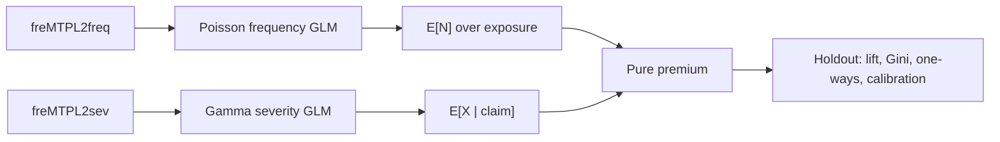
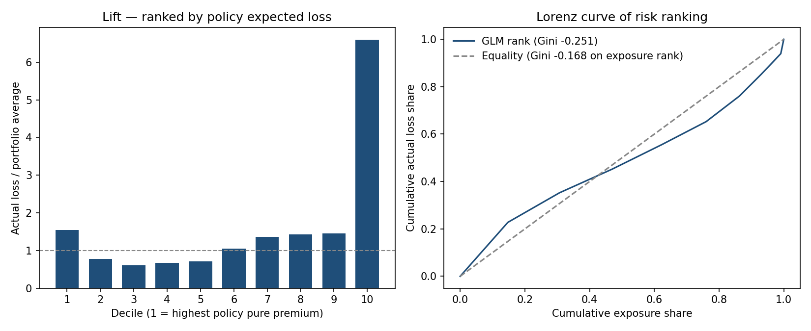
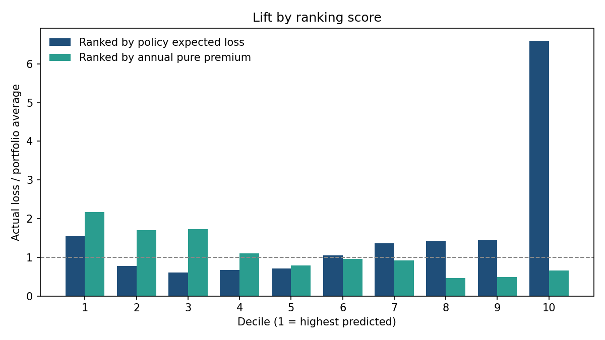
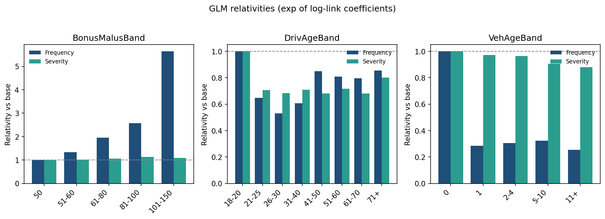
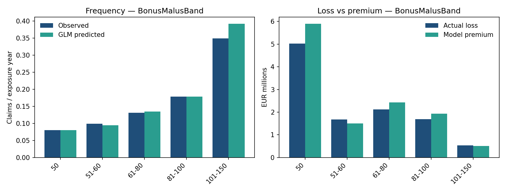
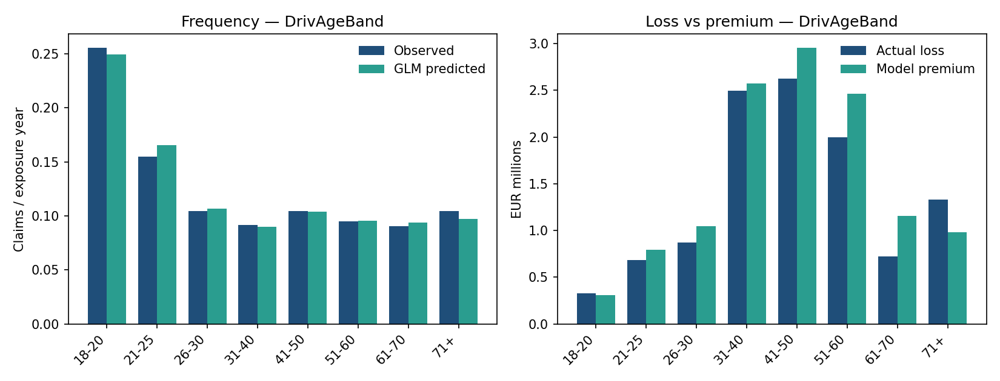
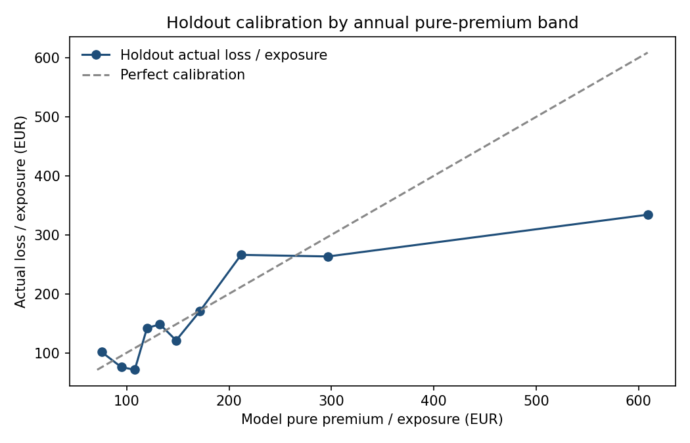

# Holdout analysis: frequency–severity GLM on freMTPL2

This note is the analysis. `run.py` is the pipeline that produced it. The question is whether a two-part technical premium ranks French motor TPL losses on a holdout better than charging everyone the same rate per year of exposure.

It is not a market quote, a filing, or a model bake-off.

## Question

For each policy, estimate expected loss from the usual motor rating factors, then check on unseen policies:

1. Does the score put more **actual** loss among the high-score policies than an exposure-weighted flat rate?
2. Does that product of means look reasonable when sliced by factor and by predicted-premium band?

Expected loss is the product of two means, not a single Tweedie GLM:

\[
\text{pure premium} = E[N] \times E[X \mid \text{claim}].
\]

`pure_premium` is expected loss over the **observed** exposure. `annual_pure_premium` is that amount divided by exposure (loss per policy-year).

## Data and clean-up

French motor third-party liability, CASdatasets `freMTPL2freq` / `freMTPL2sev` (Dutang & Charpentier). Frequency is one row per policy; severity is one row per positive claim amount.

| | |
| --- | --- |
| Policies | 678,013 |
| Exposure years | 358,360 |
| `ClaimNb` sum (after cap) | 36,056 |
| Severity rows | 26,639 |
| Policies where `ClaimNb` ≠ severity row count | 9,125 |

On this file, frequency claim counts often do not match the number of severity rows for the same `IDpol`. Frequency still uses `ClaimNb`; severity uses observed amounts. They are not forced to match. Only 9 policies have a **both-positive** count mismatch; most mismatches are count vs zero on one side.

Standard caps for this dataset: `ClaimNb` at 4 (16 policies hit the cap), exposure at 1 year, claim size at the 99.5th percentile (€34,387; 134 claims clipped) so a handful of large losses do not dominate Gamma MLE.

The 80/20 split is stratified on `ClaimNb > 0` so the severity sample is not emptied by chance (542,410 / 135,603 policies; 21,132 train claims).

## Method

Both GLMs use the same formula: categorical bands for area, vehicle power, vehicle age, driver age, bonus-malus, brand, fuel, region, plus `log(Density)`.

- **Frequency** — Poisson, log link, offset `log(Exposure)`. Predicts expected claim **count** over the observed exposure, not an annualized rate.
- **Severity** — Gamma, log link, one row per claim with the policy’s rating factors attached.
- **Actual loss** for scoring is the sum of claim amounts on the policy (0 if none).
- **Benchmark** — same total holdout loss allocated by exposure only (flat rate per year).

Relativities are \(\exp(\hat\beta)\) versus the treatment reference (bonus-malus 50, driver age 18–20, vehicle age 0, area A, diesel, brand B1, Alsace).

## Holdout ranking

Test actual loss is **€11.06M**. The GLM books **€12.27M** of pure premium (loss ratio **0.90**). That gap is a level issue (severity cap, frequency/severity mismatch, no intercept recalibration). Ranking does not require the totals to match.

Gini here orders policies by **decreasing** score. A more negative value means more actual loss sits among the high-score policies.

| Ranker | Gini |
| --- | --- |
| Policy expected loss (`pure_premium`) | −0.251 |
| Annual pure premium | −0.155 |
| Exposure only (flat rate) | −0.168 |

The GLM ranks better than a flat rate **when the score is policy expected loss**. Ranking by annual premium is slightly **worse** than ranking by exposure. Exposure length is already a strong ranker of dollar loss: a policy in force for a full year has more time to produce a claim than a one-month policy with the same risk profile.

Decile 1 (highest predicted **policy** premium) has lift **1.54** and holds about **23%** of test loss on **15%** of test exposure. Deciles 2–5 sit below 1.0. The bottom decile is noisy (lift ~6.6 on 656 exposure years): short-duration policies collect there, and a few large claims inflate the empirical rate. That is a ranking artifact, not evidence that the cheapest 10% of the book is six times average.

When the same policies are ranked by **annual** premium, the top decile lift is **2.16**, but that slice is only **6%** of exposure (high rate, short duration). The two scores answer different questions: “who will generate the most dollars this term?” versus “who is expensive per year?”

## What drives the rate

Frequency carries it. Bonus-malus 101–150 has a frequency relativity of **5.64** versus 50; 81–100 is **2.57**. On the holdout, observed frequency moves from **0.08** claims per exposure year at bonus-malus 50 to **0.35** at 101–150, and the GLM tracks that. Severity relativities on the same bands stay near 1.0–1.14.

Young drivers (18–20) are the frequency base. Ages 21–40 are about **0.53–0.65** times that frequency. Severity is lower than the 18–20 base for every older band, but the steps are small compared with frequency.

Vehicle age 0 (new) is the frequency base; older bands sit around **0.26–0.32**. That is a large frequency effect, not a severity story.

Area, brand, region, and log density are mostly small or poorly determined, especially in severity (wide standard errors, few claims per cell).

One-way loss versus premium is not a perfect overlay. Bonus-malus 50 is slightly overpriced (loss ratio 0.85); 51–60 is slightly underpriced (1.12). Driver age 61–70 is overpriced (0.63); 71+ is underpriced (1.36), a thin, volatile slice.

## Calibration

Bucketed by predicted annual premium, actual loss per exposure year still rises with the model, but the top band is **overpriced** (model ~€609 per exposure year vs actual ~€334; loss ratio 0.55). The bottom band is **underpriced** (model ~€76 vs actual ~€101). The GLM separates cheap from expensive risks; it does not nail the dollar amount in the tails.

## Caveats

- Frequency and severity files are not claim-count consistent. Do not treat \(E[N] \times E[X]\) as a reconciled compound distribution.
- Severity is fit on capped amounts; holdout actual loss is **uncapped**. That pushes the booked premium and the observed loss apart, especially in the right tail.
- Vehicle power 16+ is effectively empty after banding and shows a degenerate coefficient. It should not be read as a relativity.
- No expenses, cost of capital, competition, or credibility. Recalibrating the intercept so holdout premium equals holdout loss would change the loss ratio, not the rank order.
- Numbers above are from one stratified split (`random_state=42`). Reproduce with `python run.py` after placing the CSVs (see the README).
